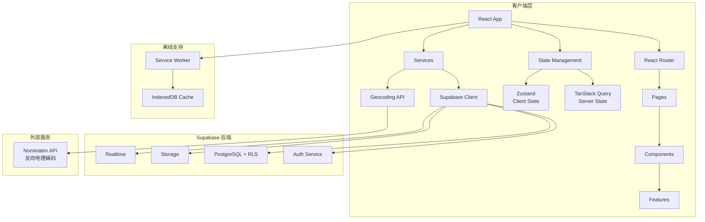
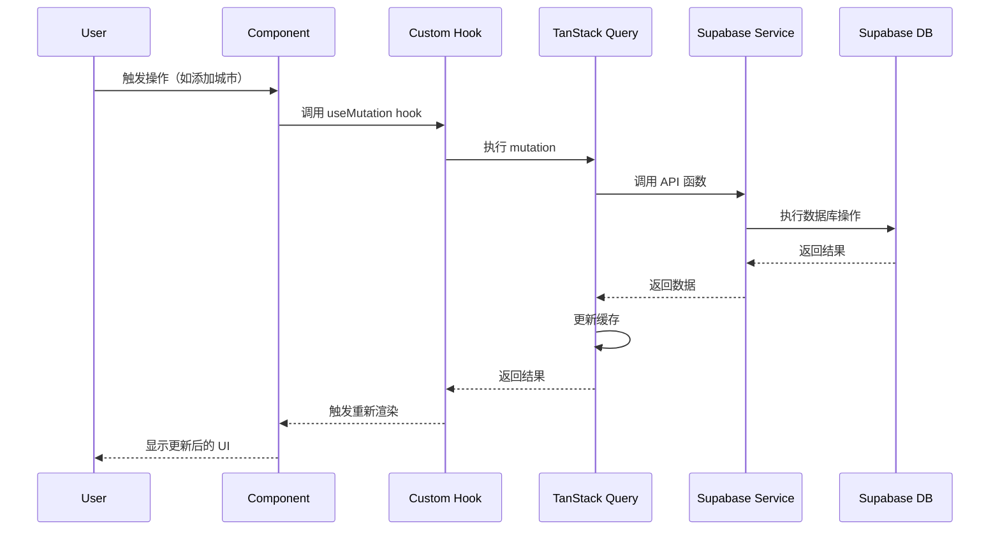
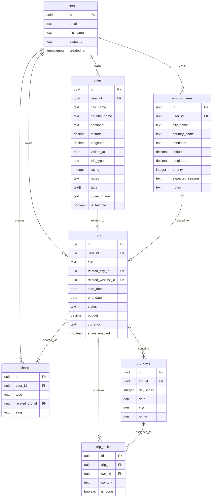

# JourneyHub 技术设计文档

## Overview

JourneyHub 是一个基于 React + TypeScript + Supabase 的现代化旅行足迹管理平台。系统采用前后端分离架构，前端使用 Vite 构建，后端依托 Supabase 提供的 BaaS 服务（认证、数据库、存储、实时订阅）。

### 核心设计目标

1. **地图驱动的交互体验**：以 Leaflet 地图为核心交互界面，用户可直接在地图上标记、查看和管理旅行足迹
2. **清晰的状态管理边界**：严格区分服务器状态（TanStack Query）和客户端状态（Zustand），避免状态混乱
3. **渐进式增强**：优先保证桌面端体验，再通过响应式设计适配移动端
4. **离线优先**：支持 PWA 和本地缓存，确保弱网环境下的可用性
5. **类型安全**：全面使用 TypeScript，所有业务实体都有严格的类型定义

### 技术栈概览

- **前端框架**：React 18 + TypeScript + Vite
- **路由管理**：React Router v6（嵌套路由、路由守卫）
- **状态管理**：
  - Server State: TanStack Query v4（数据获取、缓存、乐观更新）
  - Client State: Zustand（UI 状态、会话、表单草稿）
- **地图渲染**：Leaflet + React Leaflet
- **数据可视化**：Apache ECharts
- **UI 样式**：Tailwind CSS + Lucide React
- **表单处理**：React Hook Form + Zod
- **后端服务**：Supabase（Auth + PostgreSQL + Storage + RLS）
- **测试框架**：Vitest + React Testing Library
- **PWA 支持**：vite-plugin-pwa

## Architecture

### 系统架构图



### 分层架构

#### 1. 表现层（Presentation Layer）

- **Pages**：路由级页面组件，负责布局和数据编排
- **Components**：可复用的 UI 组件，分为 common、map、city、trip、charts、forms 等模块
- **Layouts**：应用级布局组件（AppLayout、AuthLayout）

#### 2. 业务逻辑层（Business Logic Layer）

- **Features**：按业务领域组织的功能模块，每个 feature 包含：
  - `hooks/`：自定义 React Hooks
  - `components/`：特定于该功能的组件
  - `api.ts`：API 调用函数
  - `types.ts`：类型定义
  - `utils.ts`：工具函数

#### 3. 数据访问层（Data Access Layer）

- **Services**：封装外部服务调用
  - `supabase/`：Supabase 客户端配置和 API 封装
  - `geocoding/`：地理编码服务
  - `api/`：通用 API 工具

#### 4. 状态管理层（State Management Layer）

- **TanStack Query**：管理所有服务器数据（CRUD 操作、缓存、同步）
- **Zustand**：管理客户端状态（UI 状态、会话信息、表单草稿）

### 数据流架构



## Components and Interfaces

### 目录结构

```
src/
├── app/
│   ├── router/
│   │   └── index.tsx              # 路由配置
│   ├── providers/
│   │   ├── QueryProvider.tsx      # TanStack Query 配置
│   │   ├── AuthProvider.tsx       # 认证上下文
│   │   └── index.tsx              # 组合所有 Provider
│   └── layouts/
│       ├── AppLayout.tsx          # 应用主布局
│       └── AuthLayout.tsx         # 认证页面布局
├── pages/
│   ├── home/
│   │   └── HomePage.tsx
│   ├── auth/
│   │   ├── LoginPage.tsx
│   │   └── RegisterPage.tsx
│   ├── map/
│   │   └── MapPage.tsx            # 地图主页面
│   ├── cities/
│   │   ├── CitiesPage.tsx
│   │   └── CityDetailPage.tsx
│   ├── wishlist/
│   │   └── WishlistPage.tsx
│   ├── trips/
│   │   ├── TripsPage.tsx
│   │   ├── TripDetailPage.tsx
│   │   └── TripPlannerPage.tsx
│   ├── insights/
│   │   └── InsightsPage.tsx       # 统计仪表板
│   ├── profile/
│   │   └── ProfilePage.tsx
│   └── share/
│       └── SharePage.tsx          # 公开分享页面
├── components/
│   ├── common/
│   │   ├── Button.tsx
│   │   ├── Input.tsx
│   │   ├── Modal.tsx
│   │   ├── Spinner.tsx
│   │   └── ErrorBoundary.tsx
│   ├── map/
│   │   ├── MapContainer.tsx       # 地图容器组件
│   │   ├── CityMarker.tsx         # 城市标记
│   │   ├── WishlistMarker.tsx     # 愿望清单标记
│   │   └── MapControls.tsx        # 地图控制按钮
│   ├── city/
│   │   ├── CityList.tsx
│   │   ├── CityCard.tsx
│   │   └── CityForm.tsx
│   ├── trip/
│   │   ├── TripList.tsx
│   │   ├── TripCard.tsx
│   │   ├── TripForm.tsx
│   │   └── TripTimeline.tsx
│   ├── charts/
│   │   ├── WorldHeatmap.tsx       # ECharts 世界地图
│   │   ├── YearlyChart.tsx        # 年度统计柱状图
│   │   └── ContinentPie.tsx       # 大洲分布饼图
│   └── forms/
│       ├── FormField.tsx
│       ├── DatePicker.tsx
│       └── ImageUpload.tsx
├── features/
│   ├── auth/
│   │   ├── hooks/
│   │   │   ├── useAuth.ts
│   │   │   ├── useLogin.ts
│   │   │   └── useRegister.ts
│   │   ├── api.ts
│   │   └── types.ts
│   ├── cities/
│   │   ├── hooks/
│   │   │   ├── useCities.ts
│   │   │   ├── useCity.ts
│   │   │   ├── useCreateCity.ts
│   │   │   ├── useUpdateCity.ts
│   │   │   └── useDeleteCity.ts
│   │   ├── components/
│   │   │   └── CityStats.tsx
│   │   ├── api.ts
│   │   ├── types.ts
│   │   └── utils.ts
│   ├── wishlist/
│   │   ├── hooks/
│   │   ├── api.ts
│   │   └── types.ts
│   ├── trips/
│   │   ├── hooks/
│   │   ├── api.ts
│   │   └── types.ts
│   ├── insights/
│   │   ├── hooks/
│   │   │   └── useStatistics.ts
│   │   ├── utils/
│   │   │   └── calculateStats.ts
│   │   └── types.ts
│   └── profile/
│       ├── hooks/
│       ├── api.ts
│       └── types.ts
├── services/
│   ├── supabase/
│   │   ├── client.ts              # Supabase 客户端初始化
│   │   ├── auth.ts                # 认证相关 API
│   │   ├── database.ts            # 数据库操作封装
│   │   └── storage.ts             # 文件存储 API
│   ├── geocoding/
│   │   └── nominatim.ts           # 反向地理编码
│   └── api/
│       └── client.ts              # 通用 API 客户端
├── store/
│   ├── authStore.ts               # 认证状态（Zustand）
│   ├── uiStore.ts                 # UI 状态（Zustand）
│   └── draftStore.ts              # 表单草稿（Zustand）
├── hooks/
│   ├── useGeolocation.ts          # 获取用户位置
│   ├── useDebounce.ts
│   └── useMediaQuery.ts           # 响应式断点
├── schemas/
│   ├── citySchema.ts              # Zod 验证规则
│   ├── tripSchema.ts
│   └── authSchema.ts
├── types/
│   ├── database.ts                # Supabase 数据库类型
│   ├── entities.ts                # 业务实体类型
│   └── api.ts                     # API 响应类型
├── utils/
│   ├── date.ts
│   ├── format.ts
│   └── validation.ts
└── tests/
    ├── unit/
    ├── integration/
    └── setup.ts
```

### 核心组件接口

#### MapContainer

```typescript
interface MapContainerProps {
  cities: City[];
  wishlistItems: WishlistItem[];
  selectedCityId?: string;
  onMapClick: (lat: number, lng: number) => void;
  onMarkerClick: (cityId: string) => void;
  center?: [number, number];
  zoom?: number;
}
```

#### CityForm

```typescript
interface CityFormProps {
  initialData?: Partial<City>;
  coordinates: { lat: number; lng: number };
  onSubmit: (data: CityFormData) => Promise<void>;
  onCancel: () => void;
}

interface CityFormData {
  cityName: string;
  countryName: string;
  continent: string;
  visitedAt: Date;
  tripType: 'leisure' | 'business' | 'transit';
  rating?: number;
  notes?: string;
  tags?: string[];
  coverImage?: File;
}
```

#### TripPlanner

```typescript
interface TripPlannerProps {
  tripId?: string;
  onSave: (trip: Trip) => Promise<void>;
}

interface Trip {
  id: string;
  userId: string;
  title: string;
  relatedCityId?: string;
  relatedWishlistId?: string;
  startDate: Date;
  endDate: Date;
  status: 'planning' | 'ongoing' | 'completed';
  budget?: number;
  currency?: string;
  transportation?: string;
  accommodation?: string;
  notes?: string;
  shareEnabled: boolean;
  days: TripDay[];
  tasks: TripTask[];
}
```

## Data Models

### Supabase 数据库表结构

#### users 表

```sql
CREATE TABLE users (
  id UUID PRIMARY KEY DEFAULT uuid_generate_v4(),
  email TEXT UNIQUE NOT NULL,
  nickname TEXT,
  avatar_url TEXT,
  created_at TIMESTAMPTZ DEFAULT NOW()
);
```

TypeScript 类型：

```typescript
interface User {
  id: string;
  email: string;
  nickname?: string;
  avatarUrl?: string;
  createdAt: string;
}
```

#### cities 表

```sql
CREATE TABLE cities (
  id UUID PRIMARY KEY DEFAULT uuid_generate_v4(),
  user_id UUID NOT NULL REFERENCES users(id) ON DELETE CASCADE,
  city_name TEXT NOT NULL,
  country_name TEXT NOT NULL,
  continent TEXT NOT NULL,
  latitude DECIMAL(10, 8) NOT NULL,
  longitude DECIMAL(11, 8) NOT NULL,
  visited_at DATE NOT NULL,
  trip_type TEXT CHECK (trip_type IN ('leisure', 'business', 'transit')),
  rating INTEGER CHECK (rating >= 1 AND rating <= 5),
  notes TEXT,
  tags TEXT[],
  cover_image TEXT,
  is_favorite BOOLEAN DEFAULT FALSE,
  created_at TIMESTAMPTZ DEFAULT NOW(),
  updated_at TIMESTAMPTZ DEFAULT NOW()
);

CREATE INDEX idx_cities_user_id ON cities(user_id);
CREATE INDEX idx_cities_visited_at ON cities(visited_at);
```

TypeScript 类型：

```typescript
interface City {
  id: string;
  userId: string;
  cityName: string;
  countryName: string;
  continent: string;
  latitude: number;
  longitude: number;
  visitedAt: string;
  tripType: 'leisure' | 'business' | 'transit';
  rating?: number;
  notes?: string;
  tags?: string[];
  coverImage?: string;
  isFavorite: boolean;
  createdAt: string;
  updatedAt: string;
}
```

#### wishlist_items 表

```sql
CREATE TABLE wishlist_items (
  id UUID PRIMARY KEY DEFAULT uuid_generate_v4(),
  user_id UUID NOT NULL REFERENCES users(id) ON DELETE CASCADE,
  city_name TEXT NOT NULL,
  country_name TEXT NOT NULL,
  continent TEXT NOT NULL,
  latitude DECIMAL(10, 8) NOT NULL,
  longitude DECIMAL(11, 8) NOT NULL,
  priority INTEGER CHECK (priority >= 1 AND priority <= 5) DEFAULT 3,
  expected_season TEXT,
  notes TEXT,
  created_at TIMESTAMPTZ DEFAULT NOW()
);

CREATE INDEX idx_wishlist_user_id ON wishlist_items(user_id);
```

TypeScript 类型：

```typescript
interface WishlistItem {
  id: string;
  userId: string;
  cityName: string;
  countryName: string;
  continent: string;
  latitude: number;
  longitude: number;
  priority: number;
  expectedSeason?: string;
  notes?: string;
  createdAt: string;
}
```

#### trips 表

```sql
CREATE TABLE trips (
  id UUID PRIMARY KEY DEFAULT uuid_generate_v4(),
  user_id UUID NOT NULL REFERENCES users(id) ON DELETE CASCADE,
  title TEXT NOT NULL,
  related_city_id UUID REFERENCES cities(id) ON DELETE SET NULL,
  related_wishlist_id UUID REFERENCES wishlist_items(id) ON DELETE SET NULL,
  start_date DATE NOT NULL,
  end_date DATE NOT NULL,
  status TEXT CHECK (status IN ('planning', 'ongoing', 'completed')) DEFAULT 'planning',
  budget DECIMAL(12, 2),
  currency TEXT DEFAULT 'CNY',
  transportation TEXT,
  accommodation TEXT,
  notes TEXT,
  share_enabled BOOLEAN DEFAULT FALSE,
  created_at TIMESTAMPTZ DEFAULT NOW(),
  updated_at TIMESTAMPTZ DEFAULT NOW()
);

CREATE INDEX idx_trips_user_id ON trips(user_id);
CREATE INDEX idx_trips_start_date ON trips(start_date);
```

#### trip_days 表

```sql
CREATE TABLE trip_days (
  id UUID PRIMARY KEY DEFAULT uuid_generate_v4(),
  trip_id UUID NOT NULL REFERENCES trips(id) ON DELETE CASCADE,
  day_index INTEGER NOT NULL,
  date DATE NOT NULL,
  title TEXT,
  notes TEXT,
  UNIQUE(trip_id, day_index)
);

CREATE INDEX idx_trip_days_trip_id ON trip_days(trip_id);
```

TypeScript 类型：

```typescript
interface TripDay {
  id: string;
  tripId: string;
  dayIndex: number;
  date: string;
  title?: string;
  notes?: string;
}
```

#### trip_tasks 表

```sql
CREATE TABLE trip_tasks (
  id UUID PRIMARY KEY DEFAULT uuid_generate_v4(),
  trip_id UUID NOT NULL REFERENCES trips(id) ON DELETE CASCADE,
  day_id UUID REFERENCES trip_days(id) ON DELETE SET NULL,
  content TEXT NOT NULL,
  is_done BOOLEAN DEFAULT FALSE,
  created_at TIMESTAMPTZ DEFAULT NOW()
);

CREATE INDEX idx_trip_tasks_trip_id ON trip_tasks(trip_id);
```

TypeScript 类型：

```typescript
interface TripTask {
  id: string;
  tripId: string;
  dayId?: string;
  content: string;
  isDone: boolean;
  createdAt: string;
}
```

#### shares 表

```sql
CREATE TABLE shares (
  id UUID PRIMARY KEY DEFAULT uuid_generate_v4(),
  user_id UUID NOT NULL REFERENCES users(id) ON DELETE CASCADE,
  type TEXT CHECK (type IN ('all', 'trip')) NOT NULL,
  related_trip_id UUID REFERENCES trips(id) ON DELETE CASCADE,
  slug TEXT UNIQUE NOT NULL,
  created_at TIMESTAMPTZ DEFAULT NOW()
);

CREATE INDEX idx_shares_slug ON shares(slug);
```

TypeScript 类型：

```typescript
interface Share {
  id: string;
  userId: string;
  type: 'all' | 'trip';
  relatedTripId?: string;
  slug: string;
  createdAt: string;
}
```

### Row Level Security (RLS) 策略

```sql
-- 启用 RLS
ALTER TABLE cities ENABLE ROW LEVEL SECURITY;
ALTER TABLE wishlist_items ENABLE ROW LEVEL SECURITY;
ALTER TABLE trips ENABLE ROW LEVEL SECURITY;
ALTER TABLE trip_days ENABLE ROW LEVEL SECURITY;
ALTER TABLE trip_tasks ENABLE ROW LEVEL SECURITY;
ALTER TABLE shares ENABLE ROW LEVEL SECURITY;

-- cities 表策略
CREATE POLICY "Users can view their own cities"
  ON cities FOR SELECT
  USING (auth.uid() = user_id);

CREATE POLICY "Users can insert their own cities"
  ON cities FOR INSERT
  WITH CHECK (auth.uid() = user_id);

CREATE POLICY "Users can update their own cities"
  ON cities FOR UPDATE
  USING (auth.uid() = user_id);

CREATE POLICY "Users can delete their own cities"
  ON cities FOR DELETE
  USING (auth.uid() = user_id);

-- wishlist_items 表策略（类似）
CREATE POLICY "Users can manage their own wishlist"
  ON wishlist_items FOR ALL
  USING (auth.uid() = user_id);

-- trips 表策略（类似）
CREATE POLICY "Users can manage their own trips"
  ON trips FOR ALL
  USING (auth.uid() = user_id);

-- shares 表策略（允许公开访问）
CREATE POLICY "Anyone can view shares"
  ON shares FOR SELECT
  USING (true);

CREATE POLICY "Users can manage their own shares"
  ON shares FOR INSERT, UPDATE, DELETE
  USING (auth.uid() = user_id);
```

### 数据关系图




## 路由设计

### 路由结构

```typescript
// app/router/index.tsx
const router = createBrowserRouter([
  {
    path: '/',
    element: <HomePage />,
  },
  {
    path: '/auth',
    element: <AuthLayout />,
    children: [
      {
        path: 'login',
        element: <LoginPage />,
      },
      {
        path: 'register',
        element: <RegisterPage />,
      },
    ],
  },
  {
    path: '/app',
    element: <ProtectedRoute><AppLayout /></ProtectedRoute>,
    children: [
      {
        index: true,
        element: <Navigate to="/app/map" replace />,
      },
      {
        path: 'map',
        element: <MapPage />,
        children: [
          {
            path: 'cities/:cityId',
            element: <CityDetailPanel />,
          },
          {
            path: 'new',
            element: <CityFormPanel />,
          },
        ],
      },
      {
        path: 'cities',
        element: <CitiesPage />,
      },
      {
        path: 'wishlist',
        element: <WishlistPage />,
      },
      {
        path: 'trips',
        element: <TripsPage />,
      },
      {
        path: 'trips/:tripId',
        element: <TripDetailPage />,
      },
      {
        path: 'trips/new',
        element: <TripPlannerPage />,
      },
      {
        path: 'insights',
        element: <InsightsPage />,
      },
      {
        path: 'profile',
        element: <ProfilePage />,
      },
    ],
  },
  {
    path: '/share/:slug',
    element: <SharePage />,
  },
  {
    path: '*',
    element: <NotFoundPage />,
  },
]);
```

### 路由守卫

```typescript
// pages/ProtectedRoute.tsx
export const ProtectedRoute: React.FC<{ children: React.ReactNode }> = ({ children }) => {
  const { user, isLoading } = useAuth();
  const location = useLocation();
  
  if (isLoading) {
    return <SpinnerFullPage />;
  }
  
  if (!user) {
    return <Navigate to="/auth/login" state={{ from: location }} replace />;
  }
  
  return <>{children}</>;
};
```

### URL 状态管理

使用 URL 参数管理地图状态和筛选条件：

```typescript
// hooks/useMapState.ts
export const useMapState = () => {
  const [searchParams, setSearchParams] = useSearchParams();
  
  const lat = Number(searchParams.get('lat')) || 39.9;
  const lng = Number(searchParams.get('lng')) || 116.4;
  const zoom = Number(searchParams.get('zoom')) || 10;
  
  const updateMapState = (newState: { lat?: number; lng?: number; zoom?: number }) => {
    const params = new URLSearchParams(searchParams);
    if (newState.lat) params.set('lat', String(newState.lat));
    if (newState.lng) params.set('lng', String(newState.lng));
    if (newState.zoom) params.set('zoom', String(newState.zoom));
    setSearchParams(params);
  };
  
  return { lat, lng, zoom, updateMapState };
};
```

## 状态管理设计

### TanStack Query（Server State）

管理所有服务器数据的获取、缓存和同步：

```typescript
// features/cities/hooks/useCities.ts
export const useCities = () => {
  return useQuery({
    queryKey: ['cities'],
    queryFn: async () => {
      const { data, error } = await supabase
        .from('cities')
        .select('*')
        .order('visited_at', { ascending: false });
      
      if (error) throw error;
      return data as City[];
    },
    staleTime: 5 * 60 * 1000, // 5 分钟
    cacheTime: 10 * 60 * 1000, // 10 分钟
  });
};

export const useCreateCity = () => {
  const queryClient = useQueryClient();
  
  return useMutation({
    mutationFn: async (cityData: CityFormData) => {
      const { data, error } = await supabase
        .from('cities')
        .insert(cityData)
        .select()
        .single();
      
      if (error) throw error;
      return data as City;
    },
    onSuccess: (newCity) => {
      // 乐观更新
      queryClient.setQueryData<City[]>(['cities'], (old) => 
        old ? [...old, newCity] : [newCity]
      );
      
      // 或者重新获取
      // queryClient.invalidateQueries({ queryKey: ['cities'] });
    },
  });
};
```

### Zustand（Client State）

管理客户端 UI 状态和会话信息：

```typescript
// store/uiStore.ts
interface UIState {
  sidebarOpen: boolean;
  mapView: 'cities' | 'wishlist' | 'trips';
  selectedCityId: string | null;
  isOffline: boolean;
  toggleSidebar: () => void;
  setMapView: (view: 'cities' | 'wishlist' | 'trips') => void;
  selectCity: (id: string | null) => void;
  setOfflineStatus: (isOffline: boolean) => void;
}

export const useUIStore = create<UIState>((set) => ({
  sidebarOpen: true,
  mapView: 'cities',
  selectedCityId: null,
  isOffline: false,
  toggleSidebar: () => set((state) => ({ sidebarOpen: !state.sidebarOpen })),
  setMapView: (view) => set({ mapView: view }),
  selectCity: (id) => set({ selectedCityId: id }),
  setOfflineStatus: (isOffline) => set({ isOffline }),
}));
```

```typescript
// store/draftStore.ts
interface DraftState {
  drafts: Record<string, any>;
  saveDraft: (key: string, data: any) => void;
  getDraft: (key: string) => any;
  clearDraft: (key: string) => void;
  getAllDrafts: () => Record<string, any>;
}

export const useDraftStore = create<DraftState>(
  persist(
    (set, get) => ({
      drafts: {},
      saveDraft: (key, data) => 
        set((state) => ({ 
          drafts: { ...state.drafts, [key]: data } 
        })),
      getDraft: (key) => get().drafts[key],
      clearDraft: (key) => 
        set((state) => {
          const { [key]: _, ...rest } = state.drafts;
          return { drafts: rest };
        }),
      getAllDrafts: () => get().drafts,
    }),
    {
      name: 'journey-hub-drafts',
      storage: createJSONStorage(() => localStorage),
    }
  )
);
```

```typescript
// store/authStore.ts
interface AuthState {
  user: User | null;
  session: Session | null;
  setAuth: (user: User | null, session: Session | null) => void;
  clearAuth: () => void;
}

export const useAuthStore = create<AuthState>((set) => ({
  user: null,
  session: null,
  setAuth: (user, session) => set({ user, session }),
  clearAuth: () => set({ user: null, session: null }),
}));
```

### 状态同步策略

```typescript
// hooks/useOfflineSync.ts
export const useOfflineSync = () => {
  const queryClient = useQueryClient();
  const { getAllDrafts, clearDraft } = useDraftStore();
  const { setOfflineStatus } = useUIStore();
  
  useEffect(() => {
    const handleOnline = async () => {
      setOfflineStatus(false);
      
      // 同步所有草稿
      const drafts = getAllDrafts();
      for (const [key, data] of Object.entries(drafts)) {
        try {
          // 根据 key 类型执行不同的同步操作
          if (key.startsWith('city-')) {
            await supabase.from('cities').insert(data);
          } else if (key.startsWith('trip-')) {
            await supabase.from('trips').insert(data);
          }
          clearDraft(key);
        } catch (error) {
          console.error(`Failed to sync draft ${key}:`, error);
          toast.error(`同步失败: ${key}，请手动重试`);
        }
      }
      
      // 刷新所有查询
      queryClient.invalidateQueries();
    };
    
    const handleOffline = () => {
      setOfflineStatus(true);
      toast.info('您已离线，数据将保存为草稿');
    };
    
    window.addEventListener('online', handleOnline);
    window.addEventListener('offline', handleOffline);
    
    return () => {
      window.removeEventListener('online', handleOnline);
      window.removeEventListener('offline', handleOffline);
    };
  }, []);
};
```

## API 设计

### Supabase 客户端配置

```typescript
// services/supabase/client.ts
import { createClient } from '@supabase/supabase-js';
import type { Database } from '@/types/database';

const supabaseUrl = import.meta.env.VITE_SUPABASE_URL;
const supabaseAnonKey = import.meta.env.VITE_SUPABASE_ANON_KEY;

export const supabase = createClient<Database>(supabaseUrl, supabaseAnonKey, {
  auth: {
    persistSession: true,
    autoRefreshToken: true,
    detectSessionInUrl: true,
  },
  db: {
    schema: 'public',
  },
  global: {
    headers: {
      'x-application-name': 'journey-hub',
    },
  },
});
```

### API 封装层

```typescript
// features/cities/api.ts
export const citiesApi = {
  getAll: async (): Promise<City[]> => {
    const { data, error } = await supabase
      .from('cities')
      .select('*')
      .order('visited_at', { ascending: false });
    
    if (error) throw error;
    return data;
  },
  
  getById: async (id: string): Promise<City> => {
    const { data, error } = await supabase
      .from('cities')
      .select('*')
      .eq('id', id)
      .single();
    
    if (error) throw error;
    return data;
  },
  
  create: async (cityData: Omit<City, 'id' | 'createdAt' | 'updatedAt'>): Promise<City> => {
    const { data, error } = await supabase
      .from('cities')
      .insert(cityData)
      .select()
      .single();
    
    if (error) throw error;
    return data;
  },
  
  update: async (id: string, updates: Partial<City>): Promise<City> => {
    const { data, error } = await supabase
      .from('cities')
      .update({ ...updates, updated_at: new Date().toISOString() })
      .eq('id', id)
      .select()
      .single();
    
    if (error) throw error;
    return data;
  },
  
  delete: async (id: string): Promise<void> => {
    const { error } = await supabase
      .from('cities')
      .delete()
      .eq('id', id);
    
    if (error) throw error;
  },
  
  search: async (query: string): Promise<City[]> => {
    const { data, error } = await supabase
      .from('cities')
      .select('*')
      .or(`city_name.ilike.%${query}%,country_name.ilike.%${query}%`)
      .order('visited_at', { ascending: false });
    
    if (error) throw error;
    return data;
  },
};
```

### 反向地理编码服务

```typescript
// services/geocoding/nominatim.ts
interface GeocodingResult {
  cityName: string;
  countryName: string;
  continent: string;
}

export const reverseGeocode = async (
  lat: number,
  lng: number
): Promise<GeocodingResult> => {
  const url = `https://nominatim.openstreetmap.org/reverse?format=json&lat=${lat}&lon=${lng}&accept-language=zh-CN`;
  
  const response = await fetch(url, {
    headers: {
      'User-Agent': 'JourneyHub/1.0',
    },
  });
  
  if (!response.ok) {
    throw new Error('Geocoding failed');
  }
  
  const data = await response.json();
  
  return {
    cityName: data.address.city || data.address.town || data.address.village || '未知城市',
    countryName: data.address.country || '未知国家',
    continent: getContinent(data.address.country_code),
  };
};

const getContinent = (countryCode: string): string => {
  const continentMap: Record<string, string> = {
    cn: 'Asia',
    us: 'North America',
    gb: 'Europe',
    // ... 更多映射
  };
  return continentMap[countryCode.toLowerCase()] || 'Unknown';
};
```

### 实时订阅

```typescript
// hooks/useRealtimeCities.ts
export const useRealtimeCities = () => {
  const queryClient = useQueryClient();
  
  useEffect(() => {
    const channel = supabase
      .channel('cities-changes')
      .on(
        'postgres_changes',
        {
          event: '*',
          schema: 'public',
          table: 'cities',
        },
        (payload) => {
          console.log('City changed:', payload);
          
          // 更新缓存
          queryClient.invalidateQueries({ queryKey: ['cities'] });
        }
      )
      .subscribe();
    
    return () => {
      supabase.removeChannel(channel);
    };
  }, [queryClient]);
};
```

## Correctness Properties

*属性（Property）是指在系统所有有效执行中都应该成立的特征或行为——本质上是关于系统应该做什么的形式化陈述。属性是人类可读规范和机器可验证正确性保证之间的桥梁。*

### 属性反思

在将验收标准转换为可测试属性之前，我进行了冗余性分析：

**合并的属性：**
- 需求 6 的多个统计计算属性（6.1, 6.2, 6.3, 6.7）可以合并为一个综合的统计计算属性
- 需求 2 的地图标记显示属性（2.2, 2.7）可以合并为一个属性
- 需求 9 的表单验证属性（9.2, 9.3, 9.4）可以合并为一个综合的表单验证属性

**保留的独立属性：**
- 认证相关的属性保持独立，因为它们测试不同的安全边界
- 数据持久化和缓存属性保持独立，因为它们测试不同的存储层
- UI 交互属性保持独立，因为它们测试不同的用户操作流程

### 属性 1: 邮箱和密码验证

*对于任何* 用户输入的邮箱和密码组合，当提交注册表单时，系统应该拒绝无效的邮箱格式（不包含 @ 符号或域名）和弱密码（少于 8 个字符），并接受有效的输入

**验证需求: 1.3**

### 属性 2: 登录成功生成令牌

*对于任何* 有效的用户凭据，当登录成功时，系统应该生成会话令牌并将其存储在客户端（localStorage 或 sessionStorage）

**验证需求: 1.4**

### 属性 3: 未认证用户重定向

*对于任何* 受保护的路由，当未登录用户尝试访问时，系统应该重定向到登录页面

**验证需求: 1.5**

### 属性 4: 退出登录清除数据

*对于任何* 已登录用户，当执行退出登录操作时，系统应该清除会话令牌和所有本地缓存的用户数据

**验证需求: 1.7**

### 属性 5: 地图标记显示

*对于任何* 城市记录集合和愿望清单项目集合，地图应该为每个项目显示对应的标记，并使用不同的视觉样式（颜色或图标）区分已访问城市和愿望清单城市

**验证需求: 2.2, 2.7, 4.3**

### 属性 6: 地图点击获取坐标

*对于任何* 地图上的点击位置，系统应该获取该位置的经纬度坐标

**验证需求: 2.3**

### 属性 7: 城市标记点击显示详情

*对于任何* 地图上的城市标记，当用户点击时，系统应该显示该城市的详细信息

**验证需求: 2.4**

### 属性 8: 选择城市移动地图中心

*对于任何* 城市记录，当用户在列表中选择该城市时，地图应该将中心移动到该城市的坐标位置

**验证需求: 2.6**

### 属性 9: 地图点击触发表单

*对于任何* 地图上的点击位置，系统应该显示创建城市记录的表单，并预填充该位置的坐标

**验证需求: 3.1**

### 属性 10: 反向地理编码

*对于任何* 有效的经纬度坐标，系统应该通过反向地理编码 API 获取城市名称、国家名称和大洲信息

**验证需求: 3.2**

### 属性 11: 表单验证

*对于任何* 表单提交，系统应该验证所有必填字段，如果验证失败则在对应字段下方显示错误消息，并禁用提交按钮直到所有字段有效

**验证需求: 3.4, 9.2, 9.3, 9.5**

### 属性 12: 城市记录持久化

*对于任何* 通过验证的城市记录，系统应该将其存储到数据库并关联到当前登录用户的 ID

**验证需求: 3.5**

### 属性 13: 城市列表显示

*对于任何* 用户的城市记录集合，系统应该在侧边栏列表中显示所有记录

**验证需求: 3.6**

### 属性 14: 城市记录点击显示详情

*对于任何* 列表中的城市记录，当用户点击时，系统应该显示该记录的详细信息

**验证需求: 3.7**

### 属性 15: 删除确认

*对于任何* 城市记录的删除操作，系统应该在执行删除前要求用户确认

**验证需求: 3.10**

### 属性 16: 愿望清单数据存储

*对于任何* 添加到愿望清单的城市，系统应该记录城市名称、国家名称、大洲和坐标信息

**验证需求: 4.2**

### 属性 17: 愿望清单转换预填充

*对于任何* 愿望清单项目，当用户选择转换为正式城市记录时，系统应该将该项目的城市信息预填充到创建表单中

**验证需求: 4.6**

### 属性 18: 行程必填字段

*对于任何* 行程创建表单，系统应该要求用户输入行程名称、开始日期和结束日期，并拒绝缺少这些字段的提交

**验证需求: 5.2**

### 属性 19: 行程关联城市显示

*对于任何* 行程，系统应该在行程详情页显示所有关联的城市

**验证需求: 5.7**

### 属性 20: 行程状态自动更新

*对于任何* 行程，当当前日期超过结束日期时，系统应该在列表中将其标记为已完成状态

**验证需求: 5.9**

### 属性 21: 统计数据计算

*对于任何* 城市记录集合，统计仪表板应该正确计算并显示：已访问城市总数、已访问国家总数（去重）、每个大洲的城市数量、大洲覆盖率百分比（已访问大洲数 / 7）

**验证需求: 6.1, 6.2, 6.3, 6.7**

### 属性 22: 年度统计计算

*对于任何* 城市记录集合，系统应该按访问年份分组统计旅行次数

**验证需求: 6.5**

### 属性 23: 热门城市排序

*对于任何* 城市记录集合，系统应该按访问次数降序排序并返回前 10 个城市

**验证需求: 6.6**

### 属性 24: 分享链接唯一性

*对于任何* 分享链接生成请求，系统应该创建唯一的 slug（使用 UUID 或随机字符串），确保不与现有分享链接冲突

**验证需求: 7.2**

### 属性 25: 分享页面只读

*对于任何* 有效的分享链接，访客访问时应该看到只读的地图和城市列表，不能执行编辑或删除操作

**验证需求: 7.4**

### 属性 26: 分享数据隐私过滤

*对于任何* 分享的数据，系统应该排除用户的邮箱、密码等私密信息

**验证需求: 7.5, 12.6**

### 属性 27: 撤销分享链接

*对于任何* 已创建的分享链接，当用户撤销时，该链接应该失效，后续访问应该返回 404 或错误提示

**验证需求: 7.7**

### 属性 28: 访问缓存

*对于任何* 用户访问的城市记录，系统应该将其缓存到本地存储

**验证需求: 8.2**

### 属性 29: 离线数据加载

*对于任何* 已缓存的数据，当网络不可用时，系统应该从缓存加载数据而不是显示错误

**验证需求: 8.3**

### 属性 30: 离线状态指示

*对于任何* 网络不可用的情况，系统应该显示离线状态指示器

**验证需求: 8.4**

### 属性 31: 离线草稿保存

*对于任何* 在离线状态下创建的表单数据，系统应该将其保存为草稿到本地存储

**验证需求: 8.5**

### 属性 32: 网络恢复同步

*对于任何* 保存的草稿，当网络恢复时，系统应该自动尝试同步到服务器

**验证需求: 8.6**

### 属性 33: 同步失败提示

*对于任何* 同步失败的草稿，系统应该提示用户手动重试

**验证需求: 8.7**

### 属性 34: 实时字段验证

*对于任何* 表单字段，系统应该在用户输入时实时验证并显示错误消息

**验证需求: 9.4**

### 属性 35: API 错误处理

*对于任何* 失败的 API 请求，系统应该显示用户友好的错误提示，并记录详细错误到控制台

**验证需求: 9.6, 9.7**

### 属性 36: 缓存优先策略

*对于任何* 已缓存且未过期的数据，系统应该直接使用缓存数据而不发起新的网络请求

**验证需求: 11.3**

### 属性 37: 数据隔离（RLS）

*对于任何* 数据库查询，用户应该只能访问自己创建的数据，不能访问其他用户的数据

**验证需求: 12.1**

### 属性 38: 客户端密码安全

*对于任何* 客户端存储（localStorage、sessionStorage、IndexedDB），系统不应该存储明文密码

**验证需求: 12.3**

### 属性 39: 账户删除数据清理

*对于任何* 用户账户删除操作，系统应该级联删除该用户的所有关联数据（城市记录、愿望清单、行程、分享链接）

**验证需求: 12.4**

### 属性 40: 浏览器语言检测

*对于任何* 首次访问的用户，系统应该根据浏览器的语言设置（navigator.language）自动选择中文或英文

**验证需求: 14.2**

### 属性 41: 语言切换更新

*对于任何* 语言切换操作，系统应该立即更新所有界面文本、日期格式和数字格式

**验证需求: 14.4, 14.6**

### 属性 42: 语言偏好持久化

*对于任何* 用户选择的语言，系统应该将其存储到本地存储，下次访问时自动应用

**验证需求: 14.5**

### 属性 43: 多语言地图元素

*对于任何* 地图标记和城市名称，系统应该根据当前语言显示对应的文本

**验证需求: 14.7**


## Error Handling

### 错误分类

系统采用分层错误处理策略，根据错误类型和严重程度采取不同的处理方式：

#### 1. 网络错误（Network Errors）

**场景：**
- API 请求超时
- 网络连接中断
- 服务器不可达

**处理策略：**
- 使用 TanStack Query 的自动重试机制（最多 3 次，指数退避）
- 显示用户友好的错误提示："网络连接失败，请检查您的网络设置"
- 如果有缓存数据，降级使用缓存数据
- 提供手动重试按钮

**实现示例：**
```typescript
const { data, error, refetch } = useQuery({
  queryKey: ['cities'],
  queryFn: fetchCities,
  retry: 3,
  retryDelay: (attemptIndex) => Math.min(1000 * 2 ** attemptIndex, 30000),
  onError: (error) => {
    toast.error('网络连接失败，请检查您的网络设置');
    console.error('Network error:', error);
  }
});
```

#### 2. 认证错误（Authentication Errors）

**场景：**
- 会话过期（401 Unauthorized）
- 无效的令牌
- 权限不足（403 Forbidden）

**处理策略：**
- 401 错误：清除本地令牌，重定向到登录页面
- 403 错误：显示权限不足提示，返回上一页
- 记录错误日志用于安全审计

**实现示例：**
```typescript
// Supabase 客户端拦截器
supabase.auth.onAuthStateChange((event, session) => {
  if (event === 'SIGNED_OUT' || event === 'TOKEN_REFRESHED') {
    if (!session) {
      // 清除本地数据
      queryClient.clear();
      localStorage.clear();
      // 重定向到登录页
      navigate('/login');
    }
  }
});
```

#### 3. 验证错误（Validation Errors）

**场景：**
- 表单字段验证失败
- 数据格式不正确
- 必填字段缺失

**处理策略：**
- 使用 Zod 进行客户端验证
- 在字段下方显示具体的错误消息
- 禁用提交按钮直到所有错误修复
- 实时验证，提供即时反馈

**实现示例：**
```typescript
const citySchema = z.object({
  cityName: z.string().min(1, '城市名称不能为空'),
  countryName: z.string().min(1, '国家名称不能为空'),
  visitedAt: z.date().max(new Date(), '访问日期不能是未来日期'),
  rating: z.number().min(1).max(5).optional(),
});

const { register, handleSubmit, formState: { errors } } = useForm({
  resolver: zodResolver(citySchema),
});
```

#### 4. 业务逻辑错误（Business Logic Errors）

**场景：**
- 重复添加相同城市
- 行程日期冲突
- 删除被引用的数据

**处理策略：**
- 在操作前进行业务规则检查
- 显示具体的业务错误提示
- 提供解决方案建议

**实现示例：**
```typescript
const createCity = async (cityData: CityFormData) => {
  // 检查是否已存在
  const existing = await supabase
    .from('cities')
    .select('id')
    .eq('city_name', cityData.cityName)
    .eq('user_id', user.id)
    .single();
    
  if (existing.data) {
    throw new Error('您已经添加过这个城市，可以在列表中查看或编辑');
  }
  
  // 执行创建操作
  const { data, error } = await supabase
    .from('cities')
    .insert(cityData);
    
  if (error) throw error;
  return data;
};
```

#### 5. 数据库错误（Database Errors）

**场景：**
- 外键约束违反
- 唯一性约束违反
- RLS 策略拒绝

**处理策略：**
- 捕获 Supabase 错误代码
- 转换为用户友好的消息
- 记录详细错误到控制台

**错误码映射：**
```typescript
const DB_ERROR_MESSAGES: Record<string, string> = {
  '23505': '该记录已存在',
  '23503': '无法删除，存在关联数据',
  '42501': '权限不足，无法执行此操作',
  'PGRST116': '未找到相关数据',
};

const handleDatabaseError = (error: PostgrestError) => {
  const message = DB_ERROR_MESSAGES[error.code] || '数据库操作失败，请稍后重试';
  toast.error(message);
  console.error('Database error:', error);
};
```

#### 6. 文件上传错误（File Upload Errors）

**场景：**
- 文件大小超限
- 文件类型不支持
- 存储空间不足

**处理策略：**
- 客户端预检查文件大小和类型
- 显示上传进度
- 失败时提供重试选项

**实现示例：**
```typescript
const uploadCityImage = async (file: File) => {
  // 预检查
  const MAX_SIZE = 5 * 1024 * 1024; // 5MB
  const ALLOWED_TYPES = ['image/jpeg', 'image/png', 'image/webp'];
  
  if (file.size > MAX_SIZE) {
    throw new Error('图片大小不能超过 5MB');
  }
  
  if (!ALLOWED_TYPES.includes(file.type)) {
    throw new Error('只支持 JPG、PNG、WebP 格式的图片');
  }
  
  // 上传
  const { data, error } = await supabase.storage
    .from('city-images')
    .upload(`${user.id}/${Date.now()}-${file.name}`, file);
    
  if (error) {
    if (error.message.includes('storage')) {
      throw new Error('存储空间不足，请联系管理员');
    }
    throw error;
  }
  
  return data;
};
```

### 全局错误边界

使用 React Error Boundary 捕获未处理的错误：

```typescript
class ErrorBoundary extends React.Component<Props, State> {
  state = { hasError: false, error: null };
  
  static getDerivedStateFromError(error: Error) {
    return { hasError: true, error };
  }
  
  componentDidCatch(error: Error, errorInfo: React.ErrorInfo) {
    // 记录到错误监控服务（如 Sentry）
    console.error('Uncaught error:', error, errorInfo);
  }
  
  render() {
    if (this.state.hasError) {
      return (
        <div className="error-page">
          <h1>出错了</h1>
          <p>应用遇到了一个错误，请刷新页面重试</p>
          <button onClick={() => window.location.reload()}>
            刷新页面
          </button>
        </div>
      );
    }
    
    return this.props.children;
  }
}
```

### 错误日志记录

所有错误都应该记录到控制台，生产环境可以集成错误监控服务：

```typescript
const logError = (error: Error, context?: Record<string, any>) => {
  console.error('Error:', {
    message: error.message,
    stack: error.stack,
    context,
    timestamp: new Date().toISOString(),
    userAgent: navigator.userAgent,
  });
  
  // 生产环境发送到监控服务
  if (import.meta.env.PROD) {
    // Sentry.captureException(error, { extra: context });
  }
};
```

## Testing Strategy

### 测试金字塔

JourneyHub 采用双轨测试策略，结合单元测试和属性测试：

```
        /\
       /  \
      / E2E \ (少量，关键流程)
     /------\
    /        \
   / 集成测试 \ (中等数量，组件交互)
  /----------\
 /            \
/ 单元测试 + 属性测试 \ (大量，核心逻辑)
/--------------------\
```

### 1. 单元测试（Unit Tests）

**目标：** 测试独立的函数和工具类

**工具：** Vitest

**覆盖范围：**
- 工具函数（日期格式化、数据转换、验证逻辑）
- 自定义 Hooks（useGeolocation、useDebounce）
- 业务逻辑函数（统计计算、数据聚合）

**示例：**
```typescript
// utils/date.test.ts
import { describe, it, expect } from 'vitest';
import { formatDate, isDateInPast } from './date';

describe('formatDate', () => {
  it('should format date in Chinese locale', () => {
    const date = new Date('2024-01-15');
    expect(formatDate(date, 'zh-CN')).toBe('2024年1月15日');
  });
  
  it('should format date in English locale', () => {
    const date = new Date('2024-01-15');
    expect(formatDate(date, 'en-US')).toBe('January 15, 2024');
  });
});

describe('isDateInPast', () => {
  it('should return true for past dates', () => {
    const pastDate = new Date('2020-01-01');
    expect(isDateInPast(pastDate)).toBe(true);
  });
  
  it('should return false for future dates', () => {
    const futureDate = new Date('2030-01-01');
    expect(isDateInPast(futureDate)).toBe(false);
  });
});
```

### 2. 组件测试（Component Tests）

**目标：** 测试 React 组件的渲染和交互

**工具：** Vitest + React Testing Library

**覆盖范围：**
- 表单组件（CityForm、TripForm）
- 列表组件（CityList、TripList）
- 通用 UI 组件（Button、Modal、Input）

**示例：**
```typescript
// components/city/CityForm.test.tsx
import { describe, it, expect, vi } from 'vitest';
import { render, screen, fireEvent, waitFor } from '@testing-library/react';
import { CityForm } from './CityForm';

describe('CityForm', () => {
  it('should render all form fields', () => {
    render(<CityForm coordinates={{ lat: 0, lng: 0 }} onSubmit={vi.fn()} />);
    
    expect(screen.getByLabelText('城市名称')).toBeInTheDocument();
    expect(screen.getByLabelText('国家')).toBeInTheDocument();
    expect(screen.getByLabelText('访问日期')).toBeInTheDocument();
  });
  
  it('should show validation errors for empty fields', async () => {
    const onSubmit = vi.fn();
    render(<CityForm coordinates={{ lat: 0, lng: 0 }} onSubmit={onSubmit} />);
    
    const submitButton = screen.getByRole('button', { name: '提交' });
    fireEvent.click(submitButton);
    
    await waitFor(() => {
      expect(screen.getByText('城市名称不能为空')).toBeInTheDocument();
    });
    
    expect(onSubmit).not.toHaveBeenCalled();
  });
  
  it('should call onSubmit with valid data', async () => {
    const onSubmit = vi.fn();
    render(<CityForm coordinates={{ lat: 39.9, lng: 116.4 }} onSubmit={onSubmit} />);
    
    fireEvent.change(screen.getByLabelText('城市名称'), {
      target: { value: '北京' }
    });
    fireEvent.change(screen.getByLabelText('国家'), {
      target: { value: '中国' }
    });
    
    const submitButton = screen.getByRole('button', { name: '提交' });
    fireEvent.click(submitButton);
    
    await waitFor(() => {
      expect(onSubmit).toHaveBeenCalledWith(
        expect.objectContaining({
          cityName: '北京',
          countryName: '中国',
        })
      );
    });
  });
});
```

### 3. 属性测试（Property-Based Tests）

**目标：** 验证系统属性在大量随机输入下都成立

**工具：** fast-check（JavaScript 的属性测试库）

**配置：** 每个属性测试至少运行 100 次迭代

**标签格式：** `Feature: journey-hub-platform, Property {number}: {property_text}`

**覆盖范围：**
- 所有在 Correctness Properties 部分定义的 43 个属性

**示例：**
```typescript
// features/cities/cities.property.test.ts
import { describe, it, expect } from 'vitest';
import { fc } from 'fast-check';
import { calculateStatistics } from './utils';

describe('Property Tests - Statistics', () => {
  /**
   * Feature: journey-hub-platform, Property 21: 统计数据计算
   * 对于任何城市记录集合，统计仪表板应该正确计算并显示：
   * 已访问城市总数、已访问国家总数（去重）、每个大洲的城市数量、大洲覆盖率百分比
   */
  it('should correctly calculate statistics for any city collection', () => {
    fc.assert(
      fc.property(
        fc.array(
          fc.record({
            id: fc.uuid(),
            cityName: fc.string({ minLength: 1 }),
            countryName: fc.string({ minLength: 1 }),
            continent: fc.constantFrom('Asia', 'Europe', 'Africa', 'North America', 'South America', 'Oceania', 'Antarctica'),
          }),
          { minLength: 0, maxLength: 100 }
        ),
        (cities) => {
          const stats = calculateStatistics(cities);
          
          // 城市总数应该等于数组长度
          expect(stats.totalCities).toBe(cities.length);
          
          // 国家总数应该小于等于城市总数
          expect(stats.totalCountries).toBeLessThanOrEqual(cities.length);
          
          // 大洲覆盖率应该在 0-100 之间
          expect(stats.continentCoverage).toBeGreaterThanOrEqual(0);
          expect(stats.continentCoverage).toBeLessThanOrEqual(100);
          
          // 每个大洲的城市数量总和应该等于城市总数
          const continentSum = Object.values(stats.citiesByContinent).reduce((a, b) => a + b, 0);
          expect(continentSum).toBe(cities.length);
        }
      ),
      { numRuns: 100 }
    );
  });
  
  /**
   * Feature: journey-hub-platform, Property 23: 热门城市排序
   * 对于任何城市记录集合，系统应该按访问次数降序排序并返回前 10 个城市
   */
  it('should return top 10 cities sorted by visit count', () => {
    fc.assert(
      fc.property(
        fc.array(
          fc.record({
            cityName: fc.string({ minLength: 1 }),
            visitCount: fc.integer({ min: 1, max: 100 }),
          }),
          { minLength: 0, maxLength: 50 }
        ),
        (cities) => {
          const topCities = getTopCities(cities, 10);
          
          // 返回的城市数量不应超过 10
          expect(topCities.length).toBeLessThanOrEqual(10);
          
          // 返回的城市数量不应超过输入数量
          expect(topCities.length).toBeLessThanOrEqual(cities.length);
          
          // 应该按访问次数降序排列
          for (let i = 0; i < topCities.length - 1; i++) {
            expect(topCities[i].visitCount).toBeGreaterThanOrEqual(topCities[i + 1].visitCount);
          }
        }
      ),
      { numRuns: 100 }
    );
  });
});
```

```typescript
// features/auth/auth.property.test.ts
import { describe, it, expect } from 'vitest';
import { fc } from 'fast-check';
import { validateEmail, validatePassword } from './validation';

describe('Property Tests - Authentication', () => {
  /**
   * Feature: journey-hub-platform, Property 1: 邮箱和密码验证
   * 对于任何用户输入的邮箱和密码组合，系统应该拒绝无效的邮箱格式和弱密码
   */
  it('should reject invalid email formats', () => {
    fc.assert(
      fc.property(
        fc.string().filter(s => !s.includes('@')),
        (invalidEmail) => {
          expect(validateEmail(invalidEmail)).toBe(false);
        }
      ),
      { numRuns: 100 }
    );
  });
  
  it('should reject weak passwords', () => {
    fc.assert(
      fc.property(
        fc.string({ maxLength: 7 }),
        (weakPassword) => {
          expect(validatePassword(weakPassword)).toBe(false);
        }
      ),
      { numRuns: 100 }
    );
  });
  
  it('should accept valid email and strong password', () => {
    fc.assert(
      fc.property(
        fc.emailAddress(),
        fc.string({ minLength: 8 }),
        (email, password) => {
          expect(validateEmail(email)).toBe(true);
          expect(validatePassword(password)).toBe(true);
        }
      ),
      { numRuns: 100 }
    );
  });
});
```

### 4. 集成测试（Integration Tests）

**目标：** 测试多个组件和服务的协作

**工具：** Vitest + React Testing Library + MSW（Mock Service Worker）

**覆盖范围：**
- 认证流程（登录 → 获取用户数据 → 显示主页）
- 城市创建流程（点击地图 → 填写表单 → 提交 → 更新列表）
- 数据同步流程（离线创建 → 网络恢复 → 自动同步）

**示例：**
```typescript
// features/cities/cities.integration.test.tsx
import { describe, it, expect, beforeAll, afterAll, afterEach } from 'vitest';
import { render, screen, fireEvent, waitFor } from '@testing-library/react';
import { setupServer } from 'msw/node';
import { rest } from 'msw';
import { QueryClient, QueryClientProvider } from '@tanstack/react-query';
import { MapPage } from '@/pages/map/MapPage';

const server = setupServer(
  rest.post('/api/cities', (req, res, ctx) => {
    return res(ctx.json({ id: '123', ...req.body }));
  }),
  rest.get('/api/cities', (req, res, ctx) => {
    return res(ctx.json([]));
  })
);

beforeAll(() => server.listen());
afterEach(() => server.resetHandlers());
afterAll(() => server.close());

describe('City Creation Flow', () => {
  it('should create city from map click', async () => {
    const queryClient = new QueryClient();
    
    render(
      <QueryClientProvider client={queryClient}>
        <MapPage />
      </QueryClientProvider>
    );
    
    // 模拟地图点击
    const map = screen.getByTestId('map-container');
    fireEvent.click(map, { clientX: 100, clientY: 100 });
    
    // 表单应该出现
    await waitFor(() => {
      expect(screen.getByLabelText('城市名称')).toBeInTheDocument();
    });
    
    // 填写表单
    fireEvent.change(screen.getByLabelText('城市名称'), {
      target: { value: '上海' }
    });
    fireEvent.change(screen.getByLabelText('国家'), {
      target: { value: '中国' }
    });
    
    // 提交
    fireEvent.click(screen.getByRole('button', { name: '提交' }));
    
    // 应该显示成功提示
    await waitFor(() => {
      expect(screen.getByText('城市添加成功')).toBeInTheDocument();
    });
    
    // 列表应该更新
    await waitFor(() => {
      expect(screen.getByText('上海')).toBeInTheDocument();
    });
  });
});
```

### 5. E2E 测试（End-to-End Tests）

**目标：** 测试完整的用户流程

**工具：** Playwright（可选，用于关键流程）

**覆盖范围：**
- 用户注册 → 登录 → 添加城市 → 查看统计 → 退出
- 创建行程 → 添加城市 → 生成分享链接 → 访客查看

**注意：** E2E 测试运行较慢，只用于最关键的用户流程

### 测试覆盖率目标

- **单元测试覆盖率：** ≥ 80%（工具函数和业务逻辑）
- **组件测试覆盖率：** ≥ 70%（关键组件）
- **属性测试：** 覆盖所有 43 个定义的属性
- **集成测试：** 覆盖 5-10 个关键流程
- **E2E 测试：** 覆盖 2-3 个核心用户旅程

### CI/CD 集成

所有测试应该在 CI/CD 流程中自动运行：

```yaml
# .github/workflows/test.yml
name: Test

on: [push, pull_request]

jobs:
  test:
    runs-on: ubuntu-latest
    steps:
      - uses: actions/checkout@v3
      - uses: actions/setup-node@v3
        with:
          node-version: '18'
      - run: npm ci
      - run: npm run test:unit
      - run: npm run test:property
      - run: npm run test:integration
      - run: npm run test:coverage
```

### 测试最佳实践

1. **测试隔离：** 每个测试应该独立运行，不依赖其他测试的状态
2. **Mock 外部依赖：** 使用 MSW mock API 请求，避免依赖真实后端
3. **快速反馈：** 单元测试和属性测试应该在 1 秒内完成
4. **清晰的测试名称：** 使用描述性的测试名称，说明测试的场景和预期结果
5. **避免过度测试：** 不要测试第三方库的功能，只测试自己的代码
6. **属性测试优先：** 对于通用规则，优先使用属性测试而不是大量的单元测试

